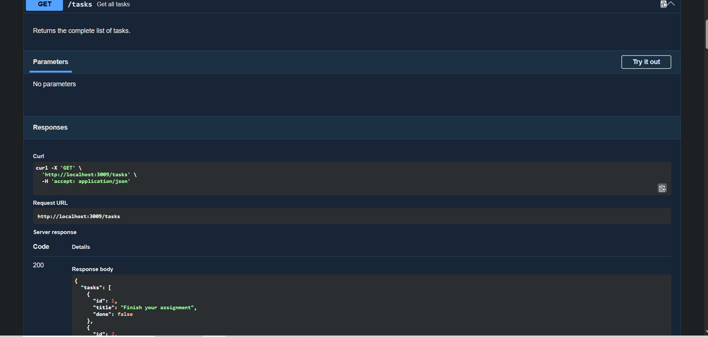

# Task API

A simple REST API built with Node.js and Express for managing tasks.

The project demonstrates a complete CRUD API with input validation, HTTP status codes, in-memory data storage, and interactive Swagger/OpenAPI documentation.

## Features

* Create tasks
* List all tasks
* Get a task by ID
* Update a task
* Delete a task
* Input validation
* Proper HTTP status codes
* Swagger UI documentation

## Technologies

* Node.js
* Express.js
* Swagger UI
* OpenAPI 3.0

## Installation

Clone the repository and install the dependencies:

```bash
git clone https://github.com/YOUR-USERNAME/task-api.git
cd task-api
npm install
```

## Run the API

```bash
npm start
```

The server runs at:

```text
http://localhost:3000
```

Swagger documentation is available at:

```text
http://localhost:3000/docs
```

## API Endpoints

| Method | Endpoint     | Description      | Success Status |
| ------ | ------------ | ---------------- | -------------- |
| GET    | `/`          | API information  | `200`          |
| GET    | `/health`    | Check API health | `200`          |
| GET    | `/tasks`     | Get all tasks    | `200`          |
| GET    | `/tasks/:id` | Get one task     | `200`          |
| POST   | `/tasks`     | Create a task    | `201`          |
| PUT    | `/tasks/:id` | Update a task    | `200`          |
| DELETE | `/tasks/:id` | Delete a task    | `204`          |

## Create a Task

Example request:

```bash
curl -i -X POST http://localhost:3000/tasks -H "Content-Type: application/json" -d "{\"title\":\"Buy milk\"}"
```

Example response:

```text
HTTP/1.1 201 Created
X-Powered-By: Express
Content-Type: application/json; charset=utf-8

{"id":4,"title":"Buy milk","done":false}
```

## Example Task

```json
{
  "id": 1,
  "title": "Learn Express",
  "done": false
}
```

## Validation

Creating a task without a title returns:

```text
400 Bad Request
```

Example:

```json
{
  "error": "Title is required"
}
```

Requesting a task that does not exist returns:

```text
404 Not Found
```

Example:

```json
{
  "error": "Task 99 not found"
}
```

## Swagger UI

Interactive API documentation is available at:

```text
http://localhost:3000/docs
```

Swagger allows the full CRUD API to be tested directly from the browser without using curl.



## Data Storage

Tasks are currently stored in an in-memory JavaScript array.

This means data resets whenever the server restarts. No external database is required for this project.
